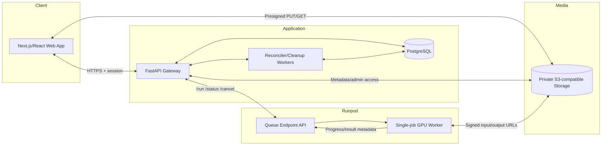

# System Architecture Specification

## 1. উদ্দেশ্য ও architecture goals

এই architecture একটি browser-based asynchronous motion-transfer platform বাস্তবায়নের জন্য। User portrait upload করবে, webcam দিয়ে 5–15 সেকেন্ড motion clip record করবে, backend নিরাপদে Runpod Serverless GPU job orchestrate করবে এবং generated MP4 private object storage থেকে user-কে দেবে।

প্রধান লক্ষ্য:

1. Low-VRAM client-এ শুধু capture/upload/playback; inference cloud GPU-তে।
2. Runpod এবং storage secrets browser থেকে সম্পূর্ণ বিচ্ছিন্ন রাখা।
3. Large media API payload limit এড়িয়ে object storage দিয়ে transfer।
4. Browser refresh, webhook loss এবং worker failure-এর পরও durable job state।
5. MimicMotion temporal continuity রক্ষায় one clip = one job।
6. Cost, queue delay, cold start এবং failure observable করা।
7. ভবিষ্যৎ scale, quota এবং billing-এর জন্য clean domain boundaries রাখা।

## 2. Existing repository assessment

### 2.1 Reusable components

- Model and pipeline construction: `mimicmotion/utils/loader.py:15-64`।
- DWPose preprocessing: `mimicmotion/dwpose/preprocess.py:23-58`।
- Core overlapping tile inference: `mimicmotion/pipelines/pipeline_mimicmotion.py:539-603`।
- Video writing helper: `mimicmotion/utils/utils.py:8-11`।
- Existing CLI flow: `inference.py:56-82`।
- Cog model setup/predict parameters: `predict.py:46-189` এবং `predict.py:288-363`।

### 2.2 Constraints/blockers

- Current product is offline diffusion, not live streaming।
- Cog setup downloads artifacts during setup (`predict.py:47-64`), which can produce long cold starts।
- Predictor mutates model config/default dtype when versions change (`predict.py:166-189`); concurrent execution unsafe।
- Cog path adds pose batch dimension at `predict.py:338`, while pipeline treats dimension 0 as time at `mimicmotion/pipelines/pipeline_mimicmotion.py:569`; this needs a regression test and fix।
- Independent jobs share no latent, scheduler or temporal state; external chunk stitching is not equivalent to internal tiling।
- DWPose affine fit uses submitted clip frames globally (`mimicmotion/dwpose/preprocess.py:40-49`), another reason to process a clip as one job।

## 3. High-level architecture



## 4. Technology baseline

| Layer | Recommended baseline | কারণ |
|---|---|---|
| Web | Next.js + React + TypeScript | Browser capture, authenticated pages, typed API client |
| API | FastAPI + Python | Existing ML ecosystem, Runpod Python SDK/HTTP integration |
| Validation | Pydantic | Versioned request/response contracts |
| Database | PostgreSQL | Transactions, row locking, durable relational state |
| ORM/migrations | SQLAlchemy + Alembic | Explicit models and schema evolution |
| Object storage | S3-compatible private bucket | Large media, signed access, persistence |
| Background work | Lightweight DB-backed scheduler initially; dedicated queue later | Reconciliation/cleanup without premature infrastructure |
| Worker | Python + Runpod SDK + PyTorch/CUDA + FFmpeg | Existing MimicMotion reuse |
| Containers | Separate web, API and GPU worker images | Independent deploy/scale/security boundaries |
| CI | Lint, unit, contract, container build, GPU smoke stage | Regression control |

Framework choices implementation spike-এ পরিবর্তন করা যেতে পারে, কিন্তু security/data-flow decisions অপরিবর্তিত থাকবে।

## 5. Architectural decisions (ADRs)

### ADR-001: Queue-based endpoint

**Decision:** Runpod queue endpoint এবং standard handler।

**Reason:** Generation long-running, queueable এবং asynchronous। Queue endpoint guaranteed execution/retry semantics, `/run`, `/status`, `/cancel` এবং progress support দেয়। Load-balancing endpoint low-latency custom HTTP/streaming-এর জন্য; MVP-এর প্রয়োজন নয়।

### ADR-002: `/run`, not `/runsync`

`/run` immediate job ID দেয় এবং result 30 মিনিট retain করে। `/runsync` wait সীমা এবং 20 MB payload থাকলেও long diffusion request-এর জন্য client connection ধরে রাখা অনুপযুক্ত। Backend result দ্রুত DB/object storage-এ materialize করবে।

### ADR-003: Object storage data plane

Control plane JSON backend/Runpod API-তে; media data plane object storage-এ। `/run` 10 MB payload limit এবং result size constraint এড়াতে base64 নিষিদ্ধ।

### ADR-004: Backend gateway

Browser Runpod-এ সরাসরি call করবে না। Backend authentication, owner authorization, quotas, idempotency, signed URL, Runpod secret এবং state reconciliation পরিচালনা করবে।

### ADR-005: One clip per inference

5–15 সেকেন্ড complete motion clip এক Runpod handler invocation। Internal `tile_size/tile_overlap` pipeline-এর ভিতর থাকবে। Independent chunk jobs MVP-তে নিষিদ্ধ।

### ADR-006: Concurrency one per GPU worker

MimicMotion GPU-intensive এবং shared pipeline mutable। Worker handler concurrency `1`; endpoint multiple worker দিয়ে horizontal scale করবে।

### ADR-007: Versioned server-side inference profiles

User arbitrary tile/steps/resolution পাবে না। Profile ID backend resolves এবং attempt-এ immutable snapshot রাখে। এতে OOM/cost guardrail ও reproducibility থাকে।

### ADR-008: Persistent private media

No default expiry, কিন্তু per-user quota, explicit deletion, account purge এবং orphan cleanup আবশ্যক। Public object URL নয়।

## 6. Component responsibilities

### 6.1 Web client

- Account UI এবং authenticated routing।
- Portrait local preview এবং upload।
- Camera enumerate/permission/preview/recording।
- Supported `MediaRecorder` MIME নির্বাচন।
- Recording 5–15 sec UX enforcement।
- Direct presigned upload with progress/retry।
- Generation submit idempotency key।
- Application API status poll; Runpod নয়।
- Playback via refreshed signed GET URL।
- History, cancel, retry, delete।

Web client authoritative security validation করবে না।

### 6.2 Application API

- Authentication/session এবং owner authorization।
- Media upload sessions and completion verification।
- Generation state machine।
- Quota/rate limit।
- Inference profile resolution।
- Runpod `/run`, `/status`, `/cancel`, optional `/retry` integration।
- Signed input/output/playback URL issuance।
- Webhook receiving and verification/confirmation।
- Sanitized error mapping।
- Audit/usage records।

### 6.3 Background services

- Non-terminal Runpod job reconciliation।
- Retry scheduling।
- Expired upload cleanup।
- Orphan object cleanup।
- User/account deletion purge।
- Usage aggregation এবং stuck job alerts।

Scheduler horizontally safe হতে advisory lock, `FOR UPDATE SKIP LOCKED` বা equivalent lease ব্যবহার করবে।

### 6.4 GPU worker

- Heavy model initialization once per worker lifecycle।
- Input schema validation।
- Scoped URL downloads, checksum verification।
- FFmpeg canonicalization।
- DWPose preprocessing।
- MimicMotion inference।
- MP4 encode এবং output upload।
- Progress update, typed errors, metrics এবং cleanup।

Worker database/API credential পাবে না; only job-scoped storage URLs এবং Runpod job metadata পাবে।

## 7. API design

Base path: `/api/v1`। JSON errors stable code + message + request ID ব্যবহার করবে।

### 7.1 Authentication

```text
POST /auth/register
POST /auth/login
POST /auth/logout
POST /auth/refresh          # token architecture হলে
GET  /me
DELETE /me                  # account deletion request
```

### 7.2 Uploads and portraits

```text
POST /uploads
POST /uploads/{upload_id}/complete
GET  /uploads/{upload_id}

POST   /portraits           # READY image asset থেকে portrait create
GET    /portraits
GET    /portraits/{id}
DELETE /portraits/{id}
```

`POST /uploads` request:

```json
{
  "kind": "MOTION_INPUT",
  "content_type": "video/webm",
  "size_bytes": 10485760,
  "sha256": "hex"
}
```

Response:

```json
{
  "upload_id": "uuid",
  "object_key": "opaque/server/generated/key",
  "method": "PUT",
  "upload_url": "short-lived signed URL",
  "expires_at": "ISO-8601",
  "required_headers": {"content-type": "video/webm"}
}
```

### 7.3 Generations

```text
POST   /generations
GET    /generations?cursor=&status=
GET    /generations/{id}
POST   /generations/{id}/cancel
POST   /generations/{id}/retry
DELETE /generations/{id}
POST   /generations/{id}/playback-url
```

Create request:

```json
{
  "portrait_id": "uuid",
  "motion_asset_id": "uuid",
  "profile": "mimicmotion-v1.1-balanced-v1"
}
```

Header: `Idempotency-Key: <uuid>`।

Create response status `202 Accepted`:

```json
{
  "id": "uuid",
  "state": "QUEUED",
  "stage": "WAITING_FOR_GPU",
  "created_at": "ISO-8601"
}
```

### 7.4 Webhook/internal operations

```text
POST /webhooks/runpod
GET  /health/live
GET  /health/ready
GET  /metrics              # private/internal
```

Webhook handler must be idempotent। If strong signature mechanism unavailable, event is a trigger and backend retrieves official job status before final transition।

## 8. Runpod worker contract

### 8.1 Input schema

```json
{
  "input": {
    "schema_version": "1.0",
    "generation_id": "uuid",
    "attempt_id": "uuid",
    "portrait": {
      "download_url": "https://allowed-storage/...",
      "sha256": "hex",
      "max_bytes": 15728640
    },
    "motion_video": {
      "download_url": "https://allowed-storage/...",
      "sha256": "hex",
      "max_bytes": 104857600,
      "min_duration_seconds": 5,
      "max_duration_seconds": 15
    },
    "output": {
      "upload_url": "https://allowed-storage/...",
      "object_key": "users/.../attempts/.../output.mp4"
    },
    "inference": {
      "profile": "mimicmotion-v1.1-balanced-v1",
      "model_version": "v1.1",
      "resolution": 576,
      "tile_size": 72,
      "tile_overlap": 6,
      "num_inference_steps": 25,
      "guidance_scale": 2.0,
      "sample_stride": 2,
      "output_fps": 15,
      "seed": 42
    }
  }
}
```

URLs sensitive; logs-এ query redact করতে হবে। Worker only HTTPS এবং configured storage hosts গ্রহণ করবে।

### 8.2 Success output

```json
{
  "schema_version": "1.0",
  "generation_id": "uuid",
  "attempt_id": "uuid",
  "status": "completed",
  "output": {
    "object_key": "users/.../output.mp4",
    "sha256": "hex",
    "content_type": "video/mp4",
    "size_bytes": 12345678,
    "duration_seconds": 12.4,
    "width": 576,
    "height": 1024,
    "fps": 15
  },
  "metrics": {
    "download_ms": 0,
    "preprocess_ms": 0,
    "pose_ms": 0,
    "inference_ms": 0,
    "encode_ms": 0,
    "upload_ms": 0,
    "peak_vram_mb": 0,
    "gpu_name": "string"
  }
}
```

### 8.3 Failure strategy

Expected input failures typed exception/error code হবে; unexpected exceptions raised হবে যাতে Runpod job `FAILED` হয়। End-user response stack trace পাবে না। Worker log correlation IDs রাখবে।

## 9. Worker internals

```text
handler.py
  -> contracts.validate(job.input)
  -> workspace.create(attempt_id)
  -> storage.download_and_verify()
  -> media.probe_and_normalize()
  -> pose.extract()
  -> inference.generate()
  -> media.encode_output()
  -> storage.upload_and_verify()
  -> manifest.build()
  -> return manifest
```

### 9.1 Model boot

Heavy initialization handler-এর বাইরে singleton/application object-এ:

```python
model_service = ModelService.from_environment()

def handler(job):
    return job_service.execute(job, model_service)
```

Model version switching request-time mutable হবে না। Production endpoint একটি fixed model profile/version image চালাবে। Upgrade rolling release/tagged image দিয়ে।

### 9.2 Model artifacts

Options benchmark করতে হবে:

1. Hugging Face cached model where compatible।
2. Required custom checkpoints worker image-এ bake।
3. Network volume only if artifact size/image practicality requires it।

Current runtime download (`predict.py:47-64`) production cold start-এর জন্য avoid করা preferred। Cached model one model limitation এবং custom files coverage যাচাই করতে হবে। Network volume region/GPU availability restrict করে।

### 9.3 Media normalization

Proposed canonical pipeline:

```text
Input WebM/MP4
  -> ffprobe validate duration/streams
  -> drop audio
  -> normalize timestamps
  -> sample/canonical FPS
  -> scale/crop according to model ratio
  -> deterministic intermediate file/frame sequence
```

Exact sampling semantics existing `preprocess.py:33-36`-এর সাথে reconcile করতে হবে, যাতে double FPS adjustment না হয়। Tests source 15/24/30/60 FPS cover করবে।

### 9.4 Pose shape regression

CLI এবং worker expected pose shape `[frames, channels, height, width]` বা pipeline contract অনুযায়ী একটিতে standardize হবে। Test cases:

- 1 frame reference + multi-frame motion indexing।
- Tile index > 0।
- 5, 10, 15 sec inputs।
- v1.1 tile size/overlap।

### 9.5 Temporary storage

- Root: configurable ephemeral path, e.g. `/tmp/mimicmotion/{attempt_id}`।
- Path traversal impossible: UUID validated।
- `finally` cleanup।
- Startup cleanup stale directories।
- Runpod SDK cleanup utility ব্যবহার করা যেতে পারে, কিন্তু app-owned lifecycle tests প্রয়োজন।

## 10. Database schema

### 10.1 Core tables

#### `users`

```text
id UUID PK
email CITEXT UNIQUE
password_hash TEXT
status ENUM(ACTIVE, SUSPENDED, DELETION_PENDING, DELETED)
storage_quota_bytes BIGINT
created_at, updated_at, deleted_at
```

#### `portraits`

```text
id UUID PK
user_id UUID FK users
original_asset_id UUID FK media_assets
thumbnail_asset_id UUID nullable
status ENUM(PROCESSING, READY, INVALID, DELETED)
created_at, deleted_at
```

#### `media_assets`

```text
id UUID PK
user_id UUID FK
kind ENUM
object_key TEXT UNIQUE
content_type TEXT
size_bytes BIGINT
sha256 CHAR(64)
width, height INTEGER nullable
duration_ms INTEGER nullable
fps NUMERIC nullable
state ENUM(CREATED, UPLOADING, UPLOADED, VALIDATING, READY, FAILED, DELETED)
created_at, ready_at, deleted_at
```

#### `generations`

```text
id UUID PK
user_id UUID FK
portrait_id UUID FK
motion_asset_id UUID FK
output_asset_id UUID nullable FK
profile_id TEXT
state ENUM
stage ENUM
latest_attempt_no INTEGER
idempotency_key TEXT
error_code TEXT nullable
created_at, started_at, completed_at, updated_at, deleted_at
UNIQUE(user_id, idempotency_key)
```

#### `generation_attempts`

```text
id UUID PK
generation_id UUID FK
attempt_no INTEGER
runpod_job_id TEXT UNIQUE nullable
state ENUM
parameters JSONB
result_manifest JSONB nullable
error_code, error_detail_sanitized nullable
worker_id nullable
queue_ms, execution_ms, peak_vram_mb nullable
created_at, submitted_at, started_at, finished_at
UNIQUE(generation_id, attempt_no)
```

#### `audit_events`

```text
id BIGSERIAL PK
user_id UUID nullable
action TEXT
resource_type TEXT
resource_id UUID nullable
request_id TEXT
metadata JSONB (no secrets)
created_at
```

#### `usage_records`

```text
id UUID PK
user_id, generation_id, attempt_id
metric_type
quantity
unit
created_at
```

### 10.2 Indexes

- `generations(user_id, created_at DESC)`।
- `generations(state, updated_at)` for reconciler।
- `generation_attempts(runpod_job_id)` unique।
- `media_assets(user_id, state, created_at)`।
- Partial index non-terminal generations।
- Audit timestamp/resource indexes।

### 10.3 Transactions

- Generation create + quota check row/advisory lock-সহ।
- State transition optimistic version বা `SELECT FOR UPDATE`।
- Completion: output asset create/ready + generation pointer + attempt terminal state এক transaction।
- Deletion: soft delete + purge outbox এক transaction।

Outbox pattern webhook/cleanup/notification reliability-এর জন্য recommended।

## 11. Runpod endpoint configuration

Initial benchmark baseline:

| Setting | Development | Production starting point |
|---|---:|---:|
| Endpoint type | Queue | Queue |
| GPU | RTX 4090 PRO 24 GB | 4090 PRO primary; benchmarked 24 GB fallback |
| GPUs/worker | 1 | 1 |
| Handler concurrency | 1 | 1 |
| Active workers | 0 | 0 cost-first or 1 latency-first |
| Max workers | 1 | 1–2 initially |
| Idle timeout | default/short | 5–30 sec based traffic |
| FlashBoot | enabled | enabled |
| Execution timeout | 30 min | benchmark P98 + safety, max bounded |
| Job TTL | 2 hr | queue P98 + execution + headroom |

Documented default execution timeout 10 minutes; benchmark ছাড়া default ব্যবহার করা যাবে না। TTL queue time-সহ total lifetime।

GPU fallback একই 24 GB memory হলেও performance আলাদা; mixed GPU pool user ETA/timeout প্রভাবিত করবে। 16 GB v1.1 path repository report অনুযায়ী borderline; production eligibility actual peak VRAM test ছাড়া নয়।

## 12. Scaling and capacity

### 12.1 Throughput model

Approximate worker throughput:

```text
jobs_per_hour_per_worker = 3600 / P90_execution_seconds
required_workers = ceil(arrival_rate_per_hour / jobs_per_hour_per_worker)
```

Active worker guidance:

```text
active_workers ≈ requests_per_minute × average_duration_seconds / 60
```

MimicMotion execution slow হওয়ায় recording chunks বাড়িয়ে queue flooding করা যাবে না। Per-user active cap এবং global max workers cost safety control।

### 12.2 Autoscaling

- Low traffic: active 0, queue-delay scaling, cold start accepted।
- Product latency target শক্ত হলে active 1।
- Max worker increase-এর আগে DB/API/S3 এবং account spend limit review।
- Multiple GPU priorities availability বাড়ায়, কিন্তু deterministic performance benchmark করতে হবে।

### 12.3 Backpressure

Backend `/health` এবং internal queue metrics ব্যবহার করে:

- New job accept কিন্তু longer ETA দেখানো।
- Global queue threshold ছাড়ালে submission temporarily reject/hold।
- User প্রতি queued job cap।
- Low-priority policy future batch jobs-এর জন্য; user-facing generation default priority।

## 13. Reliability and idempotency

### 13.1 Idempotency

- Client-generated idempotency key per deliberate submit।
- Database unique `(user_id, idempotency_key)`।
- Same key/different payload → `409 Conflict`।
- Same key/same payload → original generation return।

### 13.2 Reconciliation

Non-terminal attempts periodically `/status` poll। Suggested schedule:

- QUEUED/first minute: 5 sec।
- Long-running: 10–15 sec।
- Backoff on 429/5xx।
- Result retention 30 min-এর অনেক আগেই terminal capture।
- TTL-expired 404 state typed timeout/missing-result logic।

### 13.3 Output consistency

Attempt-specific key:

```text
users/{user_id}/generations/{generation_id}/attempts/{attempt_no}/output.mp4
```

Only verified successful attempt `generations.output_asset_id` set করবে। Failed attempt partial object cleanup হবে।

## 14. Security architecture

### 14.1 Secret matrix

| Secret | Web | API | Worker |
|---|---:|---:|---:|
| Runpod API key | No | Yes | No |
| DB credentials | No | Yes/background | No |
| S3 service credentials | No | Yes | Prefer no; signed URLs only |
| User session | Cookie/token | Verify | No |
| Signed media URL | Temporary | Issue | Job scoped |

### 14.2 Required controls

- TLS everywhere।
- Private bucket, block public access।
- Short-lived presigned URLs, object-specific method।
- CORS exact web origins।
- CSP এবং no third-party script on capture page where possible।
- CSRF protection if cookie auth।
- Password hashing, session rotation, account lock/rate limit।
- Pydantic strict validation এবং DB constraints।
- Worker outbound URL allowlist/SSRF guard।
- Container non-root where CUDA/runtime permits।
- Dependency/image scanning এবং pinned versions।
- Logs/telemetry redaction tests।

### 14.3 Privacy

- Explicit camera permission rationale।
- Persistent retention disclosure।
- Delete generation/account।
- No training reuse without separate opt-in।
- Data residency and provider policy legal review।
- Backups থাকলে deletion propagation/retention documented।

## 15. Observability

### 15.1 Structured logs

```text
timestamp, level, service, environment, request_id,
user_id, generation_id, attempt_id, runpod_job_id,
stage, duration_ms, error_code
```

Signed URL, bearer header, password, media content excluded/redacted।

### 15.2 Metrics

Application:

- Upload session/success/failure।
- Generation submission rate।
- State counts এবং age।
- Reconciliation lag।
- Cancel/retry/delete rate।
- Storage bytes/user।

Runpod/model:

- Delay P70/P90/P98।
- Cold start P70/P90/P98/count।
- Execution P70/P90/P98 by clip duration/GPU/profile।
- Pose/preprocess/inference/encode/upload timing।
- Peak VRAM এবং OOM।
- Success/failure by error code।
- Cost per successful generated second/job।

### 15.3 Alerts

- Failure rate threshold।
- OOM any sustained occurrence।
- Jobs stuck beyond expected P98।
- Reconciler not running/lag।
- Output upload failures।
- S3/DB errors।
- Runpod max worker saturation এবং queue age।
- Spend-rate threshold।

## 16. Testing architecture

### 16.1 Unit tests

- State transitions।
- Quota/idempotency।
- Contract validation।
- Error mapping।
- Object key generation।
- Signed URL redaction।
- Retry eligibility।

### 16.2 Integration tests

- PostgreSQL migrations/transactions।
- S3-compatible test bucket upload/head/download/delete।
- Runpod API mocked submission/status/cancel।
- Webhook duplicate/out-of-order events।
- Reconciler status recovery।

### 16.3 Worker tests

- Local Runpod `test_input.json`।
- Media corruption/duration/checksum।
- Pose shape regression।
- Missing pose।
- Output upload interruption।
- Temp cleanup on success/failure/cancel।
- GPU image smoke test।

### 16.4 Benchmark matrix

| Dimension | Values |
|---|---|
| Duration | 5, 10, 15 sec |
| Source FPS | 15, 24, 30, 60 |
| Browser codec | WebM VP8/VP9; supported MP4 |
| Motion | low, medium, fast |
| Framing | full/upper body, edge cases |
| GPU | selected 24 GB candidates |
| Profile | quality/speed candidates before MVP lock |

Measure quality, pose success, preprocessing, inference, total execution, output size, peak VRAM এবং cost।

### 16.5 End-to-end tests

- Register → portrait → camera fixture/upload → generation → completion → playback।
- Refresh during queue/process।
- Unauthorized cross-user access।
- Upload expiration/retry।
- API submission timeout/idempotent retry।
- Cancel race।
- Runpod timeout/retry।
- Persistent history এবং deletion।

## 17. Deployment architecture

### Environments

- `local`: mock/minimal services, local storage emulator optional।
- `staging`: separate DB/bucket/Runpod endpoint, synthetic/non-sensitive media।
- `production`: isolated secrets, bucket, endpoint and observability।

Never share object prefixes or DB between staging/production।

### Container images

- Web image: no backend secrets at build time।
- API image: migrations separately run; least privilege।
- Worker image: `linux/amd64`, CUDA-compatible, FFmpeg, model code/artifacts, pinned Runpod SDK।

Use immutable tags/digests; `latest` production deploy নয়। Runpod rolling release দিয়ে worker update।

### CI/CD gates

1. Format/lint/type checks।
2. Unit/contract tests।
3. API integration tests।
4. Container build and vulnerability scan।
5. Worker CPU contract/local handler test।
6. Staging GPU smoke benchmark।
7. Manual quality approval for model/profile/image update।
8. Rollout এবং metrics watch/rollback।

## 18. Implementation phases

### Phase 0 — Technical spikes

- Pose tensor bug reproduce/fix।
- 5/10/15 sec GPU benchmarks।
- Browser codec → FFmpeg → pipeline validation।
- Model artifact distribution/cold-start benchmark।
- Output visual continuity QA।

**Exit:** 15 sec supported clip target GPU-তে reliable এবং bounded timeout/cost-এর মধ্যে।

### Phase 1 — Worker

- Versioned contracts।
- Model singleton।
- Download/checksum/transcode।
- Inference adapter।
- Encode/upload/progress/cleanup।
- Docker + Runpod local/staging test।

### Phase 2 — Backend

- Auth/DB/migrations।
- Upload/portrait services।
- Generation state machine/idempotency/quota।
- Runpod client।
- Reconciler/webhook/cancel/retry/delete।
- Observability।

### Phase 3 — Web

- Auth/dashboard।
- Portrait manager।
- Camera recorder।
- Upload progress।
- Generation status/history/detail।
- Playback/cancel/retry/delete।
- Accessibility/browser testing।

### Phase 4 — Hardening

- Security/privacy review।
- Load/cost test।
- Failure injection।
- Alerts/runbooks।
- Internal pilot and staged rollout।

## 19. Risks and mitigations

| Risk | Impact | Mitigation |
|---|---|---|
| Inference too slow | Poor UX/cost | Honest async UX, benchmark profiles/GPU, active worker decision |
| Pose tensor defect | Job failure | Phase 0 regression test/fix |
| Browser codec variance | Decode failure | Capability detection + FFmpeg normalization |
| Cold start/model download | Long queue delay | Bake/cache model, FlashBoot, optional active worker |
| External chunks lose continuity | Flicker | One clip one job |
| Signed URL leak | Media exposure | Short TTL, redaction, exact object scope, private bucket |
| Webhook missed | Stuck state | Reconciler polling |
| Duplicate jobs | Extra cost | Idempotency key, DB uniqueness, careful submission ambiguity |
| Persistent storage growth | Cost/privacy | Quota, usage UI, deletion/purge |
| Mixed GPU variance | Timeout/quality ops issues | Benchmark each allowed GPU, duration-aware timeout |
| Runpod result expiry | Missing state | Frequent terminal reconciliation and durable DB manifest |

## 20. Official Runpod references

Architecture তৈরিতে ব্যবহৃত official documentation:

- https://docs.runpod.io/serverless/overview
- https://docs.runpod.io/serverless/quickstart
- https://docs.runpod.io/serverless/sdks
- https://docs.runpod.io/serverless/workers/handler-functions
- https://docs.runpod.io/serverless/endpoints/send-requests
- https://docs.runpod.io/serverless/endpoints/operation-reference
- https://docs.runpod.io/serverless/endpoints/endpoint-configurations
- https://docs.runpod.io/serverless/storage/overview
- https://docs.runpod.io/serverless/endpoints/job-states
- https://docs.runpod.io/serverless/development/optimization
- https://docs.runpod.io/serverless/endpoints/model-caching
- https://docs.runpod.io/serverless/pricing

Limits/settings deployment-এর সময় পুনরায় যাচাই করতে হবে, কারণ cloud platform behavior এবং pricing পরিবর্তিত হতে পারে।
