# Data Flow Diagrams (DFD)

## 1. উদ্দেশ্য

এই ডকুমেন্টে browser camera থেকে motion clip capture, object storage upload, backend orchestration, Runpod GPU inference, result persistence এবং browser delivery-এর data flow দেখানো হয়েছে। Mermaid diagram render না হলে প্রতিটি diagram-এর পরের ব্যাখ্যা canonical reference হিসেবে ব্যবহার করতে হবে।

## 2. System boundary ও actors

### External actors

- **End User:** portrait দেয়, camera clip record করে, generation পরিচালনা করে।
- **Runpod Platform:** queue, worker lifecycle এবং job API পরিচালনা করে।
- **Object Storage Provider:** input/output binary objects সংরক্ষণ করে।

### Internal systems

- **Web Client:** capture, preview, upload এবং status UI।
- **Application API:** auth, authorization, state machine এবং orchestration।
- **Background Reconciler:** Runpod status sync এবং cleanup।
- **PostgreSQL:** durable metadata, ownership এবং audit trail।
- **GPU Worker:** media preprocessing এবং MimicMotion inference।

## 3. DFD Level 0 — Context diagram

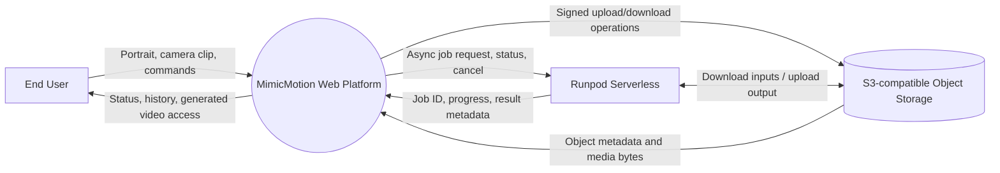

### Level 0 notes

- Browser media bytes application API দিয়ে proxy করা হবে না।
- Runpod API key কেবল Application API-এর secret boundary-তে থাকবে।
- Object storage private থাকবে; browser/worker short-lived scoped URL পাবে।
- Generated MP4 Runpod JSON result-এর মধ্যে থাকবে না।

## 4. DFD Level 1 — Main processes

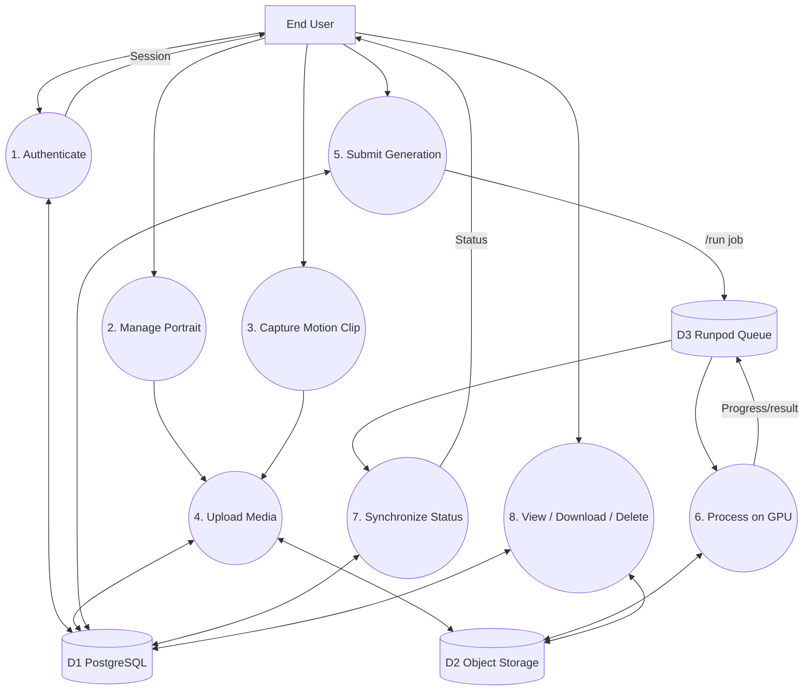

## 5. DFD Level 2 — Authentication and authorization

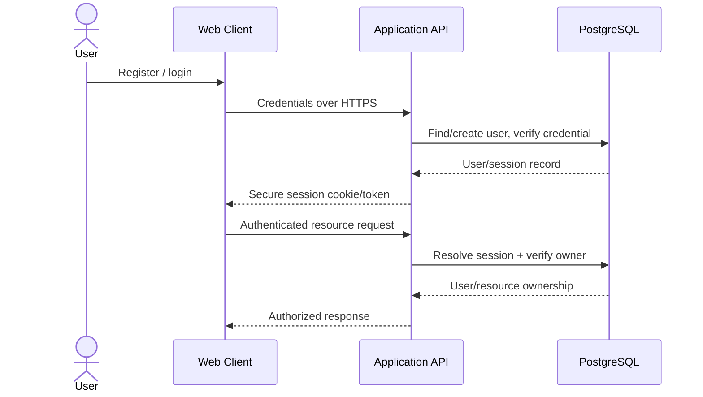

Security requirements:

- Password adaptive hash দিয়ে সংরক্ষণ করতে হবে।
- Cookie হলে `HttpOnly`, `Secure`, appropriate `SameSite` এবং CSRF protection প্রয়োজন।
- Bearer token হলে refresh/rotation/revocation policy প্রয়োজন।
- User-supplied owner ID trusted নয়; owner session থেকে resolve হবে।

## 6. DFD Level 2 — Portrait upload

```mermaid
sequenceDiagram
    actor User
    participant Web as Web Client
    participant API as Application API
    participant DB as PostgreSQL
    participant S3 as Object Storage
    participant Val as Media Validator

    User->>Web: Select portrait
    Web->>Web: Local type/size preview validation
    Web->>API: POST /uploads (kind, size, mime, checksum)
    API->>DB: Check auth/quota; create upload row
    API-->>Web: upload_id + signed PUT URL
    Web->>S3: PUT portrait bytes
    S3-->>Web: Upload response
    Web->>API: POST /uploads/{id}/complete
    API->>S3: HEAD object
    S3-->>API: Size/checksum/metadata
    API->>Val: Decode, normalize metadata, inspect image
    Val-->>API: Validation result
    API->>DB: READY or VALIDATION_FAILED
    API-->>Web: Portrait status
```

### Data elements

- Input: filename display value, MIME, bytes, checksum।
- Stored: private object, dimensions, normalized orientation, checksum, owner।
- Never stored in logs: media bytes, signed URL query, EXIF private metadata।

## 7. DFD Level 2 — Browser camera capture and upload

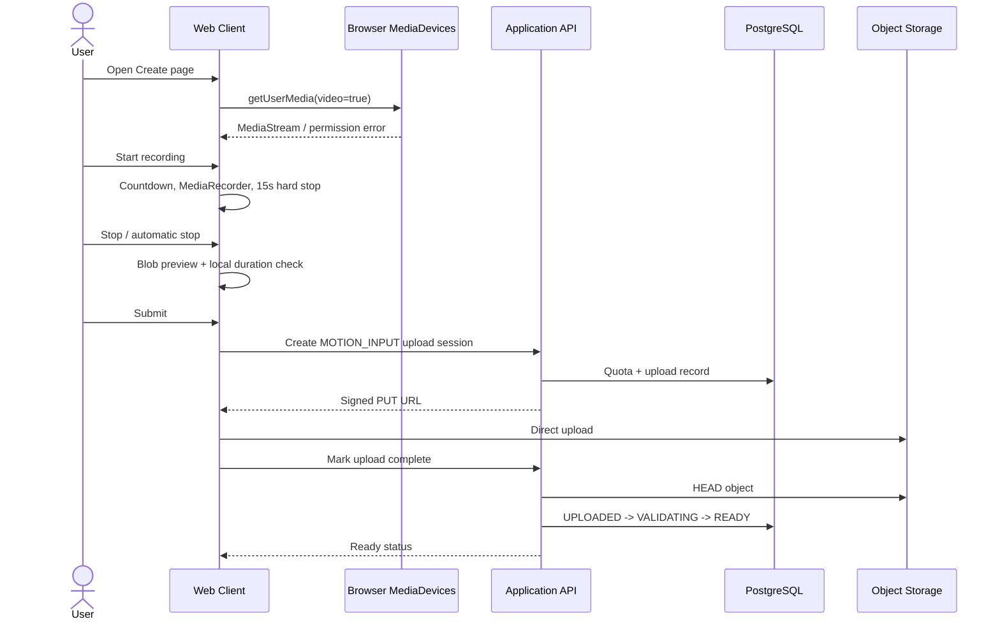

Notes:

- Client duration check UX-এর জন্য; server/worker authoritative validation করবে।
- Browser codec platform অনুযায়ী ভিন্ন হতে পারে; worker canonical transcode করবে।
- Camera stream page exit/recording শেষে stop করতে হবে।

## 8. DFD Level 2 — Generation submission

```mermaid
sequenceDiagram
    actor User
    participant Web as Web Client
    participant API as Application API
    participant DB as PostgreSQL
    participant S3 as Object Storage
    participant RP as Runpod API

    User->>Web: Generate
    Web->>API: POST /generations + Idempotency-Key
    API->>DB: Verify portrait/video ownership and READY
    API->>DB: Check active/daily/storage quota
    API->>DB: Create generation + attempt (SUBMITTING)
    API->>S3: Create scoped input GET/output PUT URLs
    S3-->>API: Signed URLs
    API->>RP: POST /run with metadata and URLs
    RP-->>API: job_id + IN_QUEUE
    API->>DB: Save job_id; state QUEUED
    API-->>Web: generation_id + QUEUED
```

### Runpod request data

```json
{
  "input": {
    "schema_version": "1.0",
    "generation_id": "uuid",
    "attempt_id": "uuid",
    "portrait": {"download_url": "signed", "sha256": "..."},
    "motion_video": {"download_url": "signed", "sha256": "..."},
    "output": {"upload_url": "signed", "object_key": "..."},
    "inference": {"profile": "mimicmotion-v1.1-balanced-v1"}
  },
  "policy": {
    "executionTimeout": 1800000,
    "ttl": 7200000
  }
}
```

Payload-এ portrait/video base64 থাকবে না।

## 9. DFD Level 2 — Runpod worker

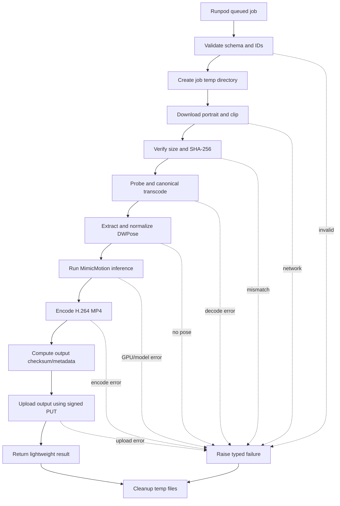

### Progress data

Worker stage boundaries-এ progress পাঠাবে:

```text
VALIDATING_INPUT
DOWNLOADING
PREPARING_MEDIA
EXTRACTING_POSE
GENERATING
ENCODING
UPLOADING_OUTPUT
DONE
```

Progress user-facing হলেও exact diffusion completion estimate guaranteed নয়।

## 10. DFD Level 2 — Status synchronization

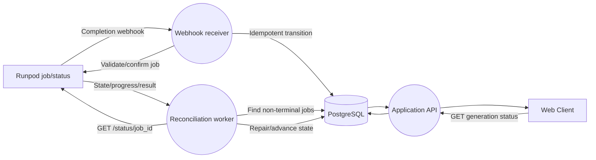

### Synchronization rules

- Webhook duplicate delivery safe হতে হবে।
- Webhook missing হলে reconciler final state উদ্ধার করবে।
- Webhook authenticity নিশ্চিত না হলে payload final truth নয়; Runpod status API দিয়ে confirm করতে হবে।
- `COMPLETED` state-এর আগে output object `HEAD` verification আবশ্যক।
- Runpod result retention 30 মিনিট (`/run`), তাই reconciler interval এমন হতে হবে যাতে result expiration-এর আগে capture হয়। Output storage-এ থাকলে metadata DB-তে দ্রুত persist করতে হবে।

## 11. DFD Level 2 — Output access

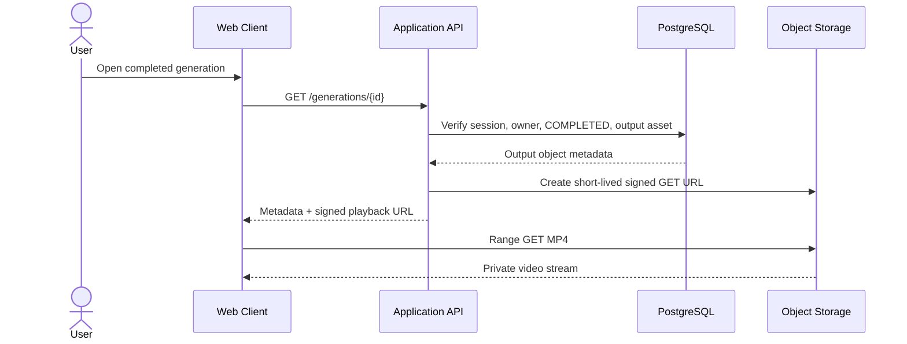

- Video playback-এর জন্য object storage/CORS এবং HTTP range request support লাগবে।
- Signed URL expiration হলে client নতুন URL চাইবে।
- URL browser history/analytics-এ leak কমাতে query redaction policy প্রয়োজন।

## 12. DFD Level 2 — Cancellation

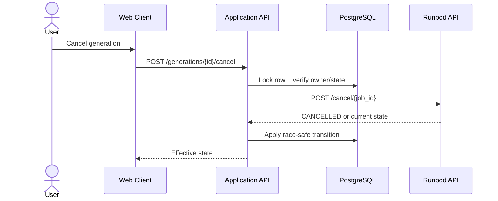

If Runpod already completed, backend output verify করে completion retain করবে; cancel response দিয়ে valid result overwrite করবে না।

## 13. DFD Level 2 — Retry

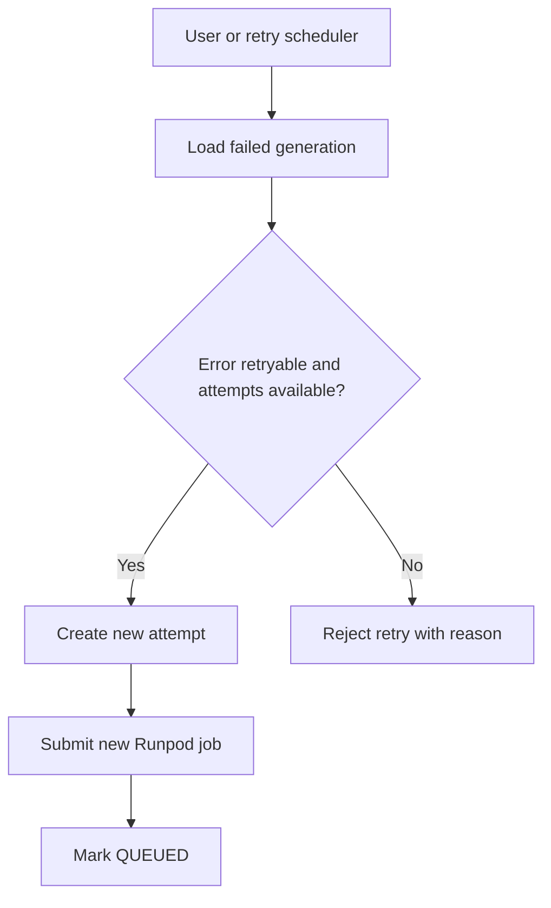

Retry generation-এর source media অপরিবর্তিত রাখবে; new attempt নতুন output object key পাবে।

## 14. DFD Level 2 — Deletion and cleanup

```mermaid
sequenceDiagram
    actor User
    participant API as Application API
    participant DB as PostgreSQL
    participant Clean as Cleanup Worker
    participant S3 as Object Storage

    User->>API: DELETE generation
    API->>DB: Verify owner; soft delete; enqueue purge
    API-->>User: Deletion accepted
    Clean->>DB: Fetch purge task/object keys
    Clean->>S3: Delete motion/output/thumbnail objects
    S3-->>Clean: Delete result
    Clean->>DB: Mark assets DELETED + audit
```

Cleanup categories:

- Expired unused upload sessions।
- Orphan storage objects।
- Worker temporary files।
- User-requested generation deletion।
- Account deletion।
- Failed attempt partial outputs।

## 15. Trust boundaries

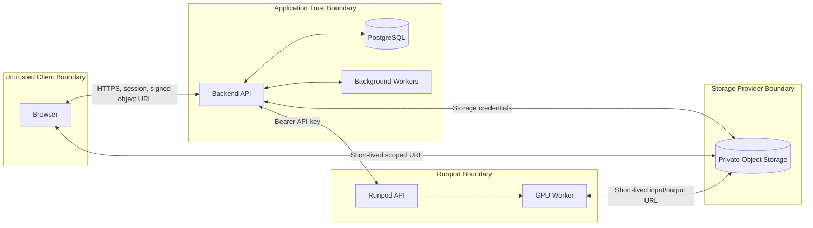

### Boundary controls

| Boundary | Controls |
|---|---|
| Browser → API | TLS, auth, CSRF/CORS, validation, rate limit |
| Browser → Storage | Presigned URL, object scope, size/type policy, short expiry |
| API → Runpod | Server-side API key, timeout, retry/backoff, no client secrets |
| Worker → Storage | Backend-issued URL, checksum, hostname allowlist |
| API → Database | Least privilege DB role, transactions, encrypted transport |

## 16. Sensitive data inventory

| Data | Location | Protection | Logging rule |
|---|---|---|---|
| Password hash | PostgreSQL | Adaptive hash | Never log |
| Session/token | Browser/API | Secure cookie/token lifecycle | Redact |
| Runpod API key | Backend secret store | Server-only | Never log |
| Storage credentials | Backend secret store | Server-only | Never log |
| Signed URL | Temporary response/job payload | Short TTL, scoped | Query redact |
| Portrait | Private storage | Owner authorization | Never log bytes |
| Camera clip | Private storage | Owner authorization | Never log bytes |
| Generated output | Private storage | Owner authorization | Never public by default |
| Job metadata | DB/Runpod | IDs and ACL | IDs allowed, URLs redacted |

## 17. Failure data flows

### Upload failure

```text
Browser upload fails
  -> retain upload_id while URL valid
  -> retry transfer or request replacement URL
  -> do not create Runpod job
  -> cleanup expired partial object
```

### Submission ambiguity

```text
Backend POST /run times out
  -> do not blindly submit again
  -> use idempotency mapping/reconcile known response where possible
  -> mark SUBMISSION_FAILED only after bounded resolution
```

### Worker failure

```text
Worker raises typed exception
  -> Runpod marks FAILED
  -> reconciler stores sanitized error code
  -> retry policy evaluates
  -> browser receives actionable message
```

### Output upload succeeded but response lost

```text
Output exists in storage
  -> Runpod state may be failed/unknown
  -> reconciler HEADs expected attempt object
  -> checksum/manifest verifies
  -> ops rule determines recoverable completion or retry
```

## 18. Observability flow

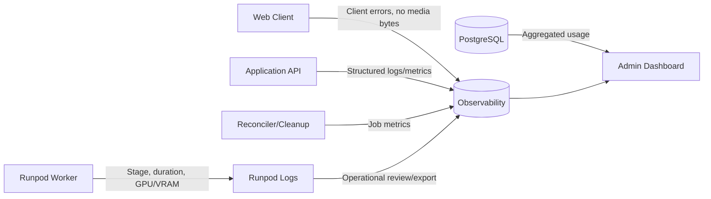

Correlation fields:

```text
request_id, user_id, generation_id, attempt_id,
runpod_job_id, worker_id, stage, error_code, duration_ms
```

## 19. Runpod documented constraints reflected in DFD

- Async `/run` request সর্বোচ্চ 10 MB; media object storage-এ।
- `/run` results completion-এর পর 30 মিনিট available; prompt reconciliation প্রয়োজন।
- Default execution timeout 10 মিনিট; request policy/profile benchmark অনুযায়ী override।
- TTL queue + execution উভয় সময় cover করবে।
- Container disk ephemeral; worker temp only।
- Worker instances shared state ধরে continuity নিশ্চিত করবে না; one clip one job।
- Heavy models handler-এর বাইরে initialize হবে।
- Result MP4 Runpod output payload নয়; object key/checksum metadata return হবে।

## 20. DFD validation checklist

- [ ] কোনো flow-তে Runpod key browser-এ যায় না।
- [ ] কোনো API JSON-এ raw/base64 video নেই।
- [ ] সব object access owner-authorized বা scoped signed URL।
- [ ] Upload complete server-side verified।
- [ ] Webhook loss reconciliation দিয়ে recoverable।
- [ ] Browser refresh generation state হারায় না।
- [ ] Cancellation race deterministic।
- [ ] Output existence যাচাই ছাড়া `COMPLETED` নয়।
- [ ] Persistent retention-এর সাথে delete ও quota flow আছে।
- [ ] Every job has generation/attempt correlation IDs।
